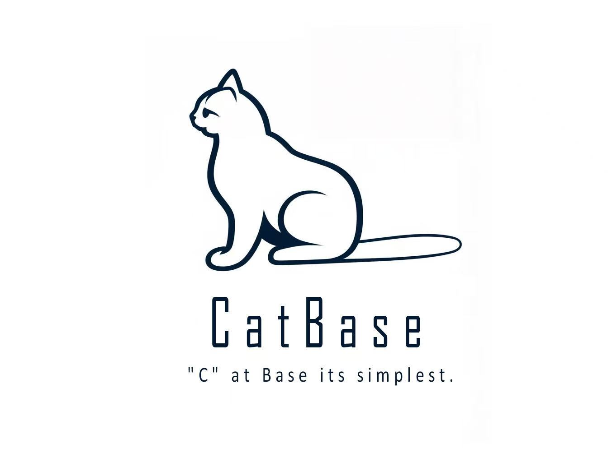

<div align="center">

> 🌐 English · **[简体中文](README_cn.md)**



# CatBase Programming Language

**A modern programming language born for AI application development** — A Python-syntax alternative to C for minimal runtime environments, compiled into high-performance native binaries.

[](http://catbase-lang.com)
[](http://dorobot.net)
[]()

[English](#) · [简体中文](README_cn.md) · [Official Docs](doc/catbase.md) · [Website](http://catbase-lang.com) · [Company](http://dorobot.net)

</div>

---

## ✨ Introduction

**CatBase** is a brand-new statically-typed programming language designed for AI application development and rapid prototyping, created by **Zhong Sheng** from China. Its syntax is similar to Python, but simpler and easier to learn; at the same time, it compiles to native executables with excellent runtime performance, making it particularly suitable for replacing C in **minimal runtime environments**.

> **Remember these 5 differences, and you can use CatBase smoothly:**
> 1. Code blocks no longer rely on indentation rules — use `{}` braces instead.
> 2. No interpreter dependency — compiles directly to native binary code.
> 3. No need to learn C pointers or memory management — write C-equivalent programs with Python syntax.
> 4. **Strongly typed**: variables must declare their types, function return values must declare types, and type names are **case-sensitive**.
> 5. Easily call `.so`/`.a` libraries, and CatBase itself can be compiled into `.so`/`.a` libraries.

The CatBase programming language was born for AI application development. In minimal runtime environments, it can replace C and supports Python syntax.

---

## 🚀 Key Features

- 🪶 **Minimalist syntax** — Python-style, no indentation hassles
- ⚡ **Native performance** — Compiles to native binary, no runtime interpreter
- 🧠 **AI-friendly** — Designed specifically for AI application development
- 🌐 **Network programming** — Full support for TCP / UDP / HTTP / WebSocket
- 🧵 **Multithreading** — Threads, mutexes, message queues, coroutines
- 📁 **File operations** — Concise file read/write API
- 🎵 **Audio processing** — Recording, playback, WAV file saving
- 🔌 **Serial communication** — RS-232 / USB-to-Serial
- 📦 **Import system** — Modular code organization
- 🛠️ **C interop** — Easily call `.so` / `.a` libraries
- 📊 **JSON handling** — Built-in JSON parsing and serialization
- ⏱️ **Time functions** — Millisecond and high-precision timing

---

## 📦 Detailed Installation Guide

### System Requirements

| Item | Requirement | Notes |
|------|------|------|
| Operating System | Linux (Ubuntu 20.04+ / Debian 11+ recommended) | Windows requires WSL or native Windows version |
| Zig Compiler | 0.14.1+ | Auto-installed by `setup-deps.sh` |
| C Compiler | gcc / clang | Required for compiling Zig runtime |
| Dependency Library | alsa-lib (optional) | For audio recording/playback |
| Tools | curl or wget | To download the Zig installer |

### Quick Install (Linux)

```bash
# 1. Extract the source package
$ tar -zxvf ./catbase_v0.0.6_linux_x86_64.tar.gz

# 2. Enter the project directory
$ cd catbase_v0.0.6_linux_x86_64

# 3. Run the dependency installer
$ ./setup-deps.sh

# 4. Compile your first CatBase program
$ ./bin/catbasecc ./examples/test_aa_HelloWorld.cat
 Compiling ./examples/test_aa_HelloWorld.cat...
 Invoking CatBase bin compiler...
 Compilation successful.

# 5. Run the generated binary
$ ./test_aa_HelloWorld
Hello world!
```

### Your First Program

Create `hello.cat`:

```cat
def main(args: list[str]) {
    print("Hello world!")
}
```

Compile and run:

```bash
$ ./bin/catbasecc hello.cat
$ ./hello
Hello world!
```

### Uninstallation

```bash
# Remove Zig installation
$ sudo rm -rf /usr/local/zig

# Remove CatBase build artifacts
$ rm -f test_aa_HelloWorld *.o runtime/*.zig runtime/*.o
```

---

## 📖 Code Examples

### Basic Syntax

```cat
# Variable declaration (strongly typed)
name: str = "CatBase"
version: float = 0.6
count: int = 100
items: list[int] = [1, 2, 3, 4, 5]

# Function definition
def add(a: int, b: int) -> int {
    return a + b
}

def main(args: list[str]) {
    # Print
    print("Hello, " + name + "!")
    print("Version: " + str(version))

    # Conditional
    if count > 50 {
        print("many")
    } else {
        print("few")
    }

    # Loop
    for i in range(0, 5) {
        print(str(i))
    }
}
```

### File Operations

```cat
def main(args: list[str]) {
    f: any = file("data.txt", "w")
    write(f, "Hello, CatBase!")
    close(f)

    f2: any = file("data.txt", "r")
    content: str = read(f2)
    print(content)
    close(f2)
}
```

### Network Programming (HTTP)

```cat
def main(args: list[str]) {
    resp: str = http_get("http://api.example.com/data", 5000)
    print(resp)
}
```

### Multithreading

```cat
def worker(id: int) {
    print("Worker " + str(id) + " started")
    sleep(1)
    print("Worker " + str(id) + " done")
}

def main(args: list[str]) {
    thread worker(1)
    thread worker(2)
    thread worker(3)
}
```

### JSON Handling

```cat
def main(args: list[str]) {
    data: dict[str, any] = {
        "name": "CatBase",
        "version": 0.6,
        "tags": ["compiler", "language", "ai"]
    }

    json_str: str = json_dumps(data)
    print(json_str)

    parsed: dict[str, any] = json_loads(json_str)
    print(parsed["name"])
}
```

> 📚 For the complete language reference, see the [**CatBase Programming Language Manual**](doc/catbase.md)

---

## 🔧 Configuration (conf/config.conf)

The `conf/config.conf` file lets you adjust compiler behavior, including Zig paths, optimization level, and error display.

### Full Configuration Example

```ini
// CatBase Configuration File

[zig]
// Zig compiler installation path (for Linux)
path = /usr/local/zig

// Zig compiler installation path (for Windows)
win_path = D:\CatBase_worksp\tools\zig

// Download URL (optional, will use default if empty)
download_url = https://ziglang.org/download/0.14.1/zig-aarch64-linux-0.14.1.tar.xz

[compiler]
// Target operating system: Linux or Windows
os = Linux

// Directory for generated runtime files
runtime_dir = runtime

// Optimization level: ReleaseFast, ReleaseSmall, ReleaseSafe
optimization = ReleaseSmall

// Whether to skip generating .o files during compilation
no_emit_obj = true

// Whether to keep Zig intermediate files (.zig) after compilation
keep_zig_files = true

// Whether to show raw Zig compiler errors
show_zig_errors = true
```

### Configuration Reference

| Config Key | Value Range | Default | Description |
|--------|----------|--------|------|
| `[zig] path` | Any directory path | `/usr/local/zig` | Zig install path on Linux. `setup-deps.sh` installs here. |
| `[zig] win_path` | Any directory path | `D:\CatBase_worksp\tools\zig` | Zig install path on Windows. |
| `[zig] download_url` | HTTP(S) URL | aarch64 Linux package | URL to download Zig. For x86 platforms, change to `zig-x86_64-linux-0.14.1.tar.xz`. |
| `[compiler] os` | `Linux` / `Windows` | `Linux` | Target operating system. |
| `[compiler] runtime_dir` | Relative path | `runtime` | Output directory for generated Zig runtime files. |
| `[compiler] optimization` | `ReleaseFast` / `ReleaseSmall` / `ReleaseSafe` | `ReleaseSmall` | Zig optimization mode: <br>• `ReleaseFast` - Fastest execution <br>• `ReleaseSmall` - Smallest executable size <br>• `ReleaseSafe` - Full runtime safety checks |
| `[compiler] no_emit_obj` | `true` / `false` | `true` | Whether to skip generating `.o` object files. |
| `[compiler] keep_zig_files` | `true` / `false` | `true` | Whether to keep `.zig` files in the `runtime/` directory. |
| `[compiler] show_zig_errors` | `true` / `false` | `true` | Whether to show raw Zig compiler errors. |

### Source Mapping Feature (show_zig_errors)

The `show_zig_errors` option controls how compilation errors are displayed:

**When `show_zig_errors = true`** (recommended for development):
- ✅ Show .cat source mapping (with line numbers and context)
- ✅ Also show original Zig compiler errors

**When `show_zig_errors = false`** (recommended for production):
- ✅ Only show .cat source mapping
- ❌ Hide original Zig errors (cleaner output)

When enabled, Zig compilation errors are automatically reverse-mapped to the corresponding `.cat` source file line numbers and context:

```
============================================================
CatBase compilation error:
============================================================

Error #1:
  --> examples/test.cat:3
  |
  | 2 |     x: int = 0
 >| 3 |     x.nonexistent_method()
  | 4 |     print(x)
  |
------------------------------------------------------------
Analysis: Type mismatch - check that method exists on this type.

============================================================

============================================================
Original Zig compiler output:
============================================================
runtime/test.zig:61:6: error: no field or member function named
    'nonexistent_method' in 'i64'
    x.nonexistent_method();
    ~^~~~~~~~~~~~~~~~~~~
============================================================
```

### Performance Tuning Suggestions

| Scenario | Recommended Config |
|------|----------|
| Development & Debugging | `optimization = ReleaseSafe`<br>`keep_zig_files = true`<br>`show_zig_errors = true` |
| Production Deployment | `optimization = ReleaseSmall`<br>`no_emit_obj = true`<br>`keep_zig_files = false` |
| Performance Benchmarking | `optimization = ReleaseFast`<br>`no_emit_obj = true` |

---

## 🧪 Running the Test Suite

```bash
# Compile and run all tests in examples/
$ for f in examples/test_*.cat; do
    ./bin/catbasecc "$f" && echo "PASS: $f" || echo "FAIL: $f"
done
```

Or use the provided test script:

```bash
$ ./checkCatbasecc.sh
```

---

## 🛣️ Roadmap

CatBase will continue to evolve. Future plans include:

- [ ] More built-in data types
- [ ] Richer standard library
- [ ] Cross-platform support (Windows, macOS, etc.)
- [ ] Better IDE support
- [ ] Package management and online registry
- [ ] Performance optimization and size reduction

We believe CatBase will become a practical, efficient, and easy-to-learn programming language, helping more developers bring their ideas to life.

---

## 👤 About the Author

The **CatBase** programming language was designed and developed by **Zhong Sheng** from China. Zhong Sheng is also the founder of **Dorobot Technology** (<http://dorobot.net>), based in Zhuhai, China.

**Dorobot Technology** (<http://dorobot.net>) is an innovative company focused on artificial intelligence and robotics, dedicated to developing intelligent solutions. CatBase was originally created as an internal programming language to address the efficiency and performance challenges encountered in project development.

> The CatBase programming language was born for AI application development. In minimal runtime environments, it can replace C and supports Python syntax.

---

## 🙏 Acknowledgments

Thanks to the following individuals and organizations for their support and contributions to CatBase:

- 🎓 **All CatBase language enthusiasts** — Thank you for your choice and trust
- 🌐 **Open Source Community** — CatBase stands on the shoulders of giants
  - 🦎 **The Zig Language Team** — For creating such an excellent compiler toolchain
  - 🐍 **The Python Community** — For providing syntax inspiration and reference
  - ⚙️ **The C Language Ecosystem** — For providing performance optimization reference
  - 💬 **The CatBase Community** — For providing feedback and suggestions
- 🏢 **Dorobot Technology Co., Ltd.** in Zhuhai, China (<http://dorobot.net>) — For providing financial support

---

## 📄 License

CatBase is distributed under a **custom End User License Agreement (EULA)**, not an open-source license. See the [LICENSE](LICENSE) file for full terms.

**Summary**:

| ✅ You **may** | ❌ You **may not** |
|------|------|
| Download and install the Software | Reverse-engineer, decompile, or disassemble the Software |
| Use the Software to compile CatBase source code | Modify, patch, or create derivative works of the Software itself |
| Distribute programs/libraries **you compiled** with the Software | Redistribute the Software binary under a different license |
| | Remove or alter copyright, attribution, or license notices |

> ⚠️ **Output binaries are yours** — the programs and libraries you compile with CatBase belong to you and are not subject to this EULA.

The Software is provided **"AS IS"**, without warranty of any kind, express or implied.

---

## 📞 Contact Us

| Channel | Link |
|------|------|
| 📧 Email | bell.zhong@dorobot.net |
| 🌐 CatBase Official Website | <http://catbase-lang.com> |
| 🏢 Dorobot Technology | <http://dorobot.net> |
| 📖 Full Documentation | [doc/catbase.md](doc/catbase.md) |
| 🐛 Issue Tracker | [GitHub Issues](../../issues) |
| 💡 Feature Suggestions | [GitHub Discussions](../../discussions) |

---

<div align="center">

**If CatBase helps you, please give it a ⭐ Star!**

Made with ❤️ in Zhuhai, China · [catbase-lang.com](http://catbase-lang.com) · [dorobot.net](http://dorobot.net)

</div>
